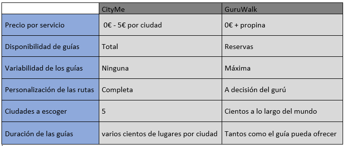

# DiuExamen

Para esta segunda parte vamos a analizar a evaluar la usabilidad y experiencia de usuario de "CityMe" frente al modelo clasico actual de "free tour" que nos ofrecen ya aplicaciones como "GuruWalk".

Para ello habra primeramente que hacer un pequeño Competitive Analysis en el que describamos los marcos en los que se mueven estas dos aplicaciones y ver si ciertamente sirven para lo mismo.

## Competitive Analysis
En primer lugar tendriamos a nuestro objeto de estudio, que nos ofrece la posibilidad de tener nuestro guia turistico online, de modo que seamos nosotros mismos los que nos moviesemos por la ciudad a nuestro ritmo y por donde mas nos interese para que luego este nos de una narrativa pregrabada sobre los sitios en los que nos encontremos, y siguiendo un modelo de negocio freemiun. Esto implica que se no se nos ofrece el 100% de los servicios de la aplicacion de manera gratuita, sino que solo una parte para que asi nosotros podamos decidir si ciertamente nos parece atractiva y util para despues comprarla y disfrutarla al maximo.

Ciertamente vemos como esta nueva aplicacion rompe con el modelo ya conocido de visitar una ciudad a cargo de un guia fisico al que habria que pagarle de primera mano para que nos haga el tour, o como ya habia propuesto "GuruWalk" que un residente o "gurus" se preste a hacernos la guia de manera gratuita. Esta ultima premisa no es del todo asi, ya que cuando reservas con estos guros, la aplicacion ya te avisa que normalmente estos gurus esperan cierta retribucion al final de la visita.

Por lo que podriamos sacar una tabla de este estilo:
