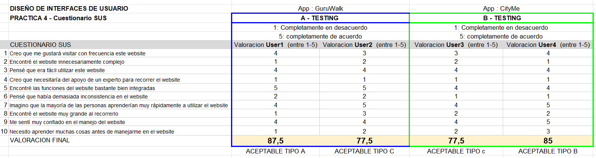
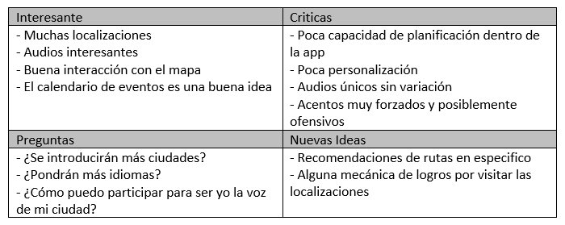

# DiuExamen

Para esta segunda parte vamos a analizar a evaluar la usabilidad y experiencia de usuario de "CityMe" frente al modelo clasico actual de "free tour" que nos ofrecen ya aplicaciones como "GuruWalk".

Para ello habra primeramente que hacer un pequeño Competitive Analysis en el que describamos los marcos en los que se mueven estas dos aplicaciones y ver si ciertamente sirven para lo mismo.

## Competitive Analysis
En primer lugar tendriamos a nuestro objeto de estudio, que nos ofrece la posibilidad de tener nuestro guia turistico online, de modo que seamos nosotros mismos los que nos moviesemos por la ciudad a nuestro ritmo y por donde mas nos interese para que luego este nos de una narrativa pregrabada sobre los sitios en los que nos encontrasemos ofreciendonos plena libertad en nuestras rutas turisticas. Hay que aclarar que este caso se plantea con un modelo de negcio fremium lo que implica que se no se nos ofrezca el 100% de los servicios de la aplicacion de manera gratuita, sino que solo una parte para que asi nosotros podamos decidir si ciertamente nos parece atractiva y util para despues comprarla y disfrutarla al maximo.

Ciertamente vemos como esta nueva aplicacion rompe con el modelo ya conocido de visitar una ciudad a cargo de un guia fisico al que habria que pagarle de primera mano para que nos haga el tour, o como ya habia propuesto "GuruWalk" que un residente o "gurus" se preste a hacernos la guia de manera gratuita. Esta ultima premisa no es del todo asi, ya que cuando reservas con estos guros, la aplicacion ya te avisa que normalmente estos gurus esperan cierta retribucion al final de la visita, pero del que la aplicacion no obtiene ningun beneficio, por lo que para los gurus seria algo asi como recibir propinas, pero para la aplicacion si que seria totalmente gratis el modelo.

Por lo que podriamos sacar una tabla de este estilo:

Ya viendo lo que la aplicacion CityMe quiere conseguir y como se diferencia de su competencia, vamos a construir a nuestra persona ficticia

## Persona ficticia

Ya teniendo a nuestro personaje ficticio, vamos a hacer dos journeyMaps con ambas aplicaciones para sacar nuestras primeras conclusiones

## Journey Map

Podemos ver como la aplicacion si que solventa ciertos problemas que despertaba el antiguo modelo de "GuruWalk". Es por ello que por ultimo y para corroborar esta decision vamos a hacer el Test SUS con dos personas aleatorias que sacaremos con los dados vistos en las sesiones de teoria y que enseñaremos a continuacion y de esta forma daremos por evaluada la aceptacion o no de esta nueva aplicacion

## Test SUS

### Personas ficticias

 Imagen de los dados para obtener los usuarios

<b>Usuario1</b>
 &emsp;2 familia - 6 persona mayor con energía - 5 disgustada
 &emsp;Experiencia baja en Windows y teléfono móvil
 &emsp;Le encanta las ciudades con historia 

Marta Nuñez (42), contable y persona extrovertida, siempre me ha gustado viajar, pero desde que tuvo a su primer hijo sin un padre que la ayudase se vio obligada a dejar esta aficion de lado para poder costearse los gastos del niño lo que le disgusto bastante. Ahora que el hijo ya tiene 12 años, puede volver a retomarlo con su hijo y enseñarle lugares aluciantes.

 <b>Usuario2</b>:
 &emsp;3 vida social - 5 fotografía - 3 felicidad
 &emsp;Experiencia media en Windows y teléfono móvil
 &emsp;Le gustaria viajar por todos lados 

Miguel Suarez (20) es un joven estudiante de universidad de granada que le va muy bien la carrera y tiene ganas de irse de viaje con su nuevo grupo de amistad de la universidad a algun lado de España

### Test SUS

## Herramientas de deteccion

Podemos ver como la sensacion de los usuarios frente a ambas aplicaciones varia en gran medida y no de manera homogenea. Mientras que la madre soltera prefiere GuruWalk, el universitario prefiere CityMe. Para averiguar el porque CityMe si consigue cautivar al publico joven mientras que al publico adulto le deja con peor sabor de boca vamos a utilizar alguna de las herramientas que hemos visto en clase y practicas como son el Captura Grid y el Empathy Map

Con el Capture Grid esperamos obtener un feedback de los usuarios a nivel funcional, cual es su experiencia haciendo uso de la aplicacion y que dudas o mejoras se les ocurre para la misma

En cambio, con el Empathy Map esperamos comprender las posibles interferencias que pueda haber entre el mapa mental que tiene el usuario de lo que podria ser una ruta guiada desde un telefono movil para asi poder adaptarla lo maximo posible para que esta sea lo mas amigable posible

